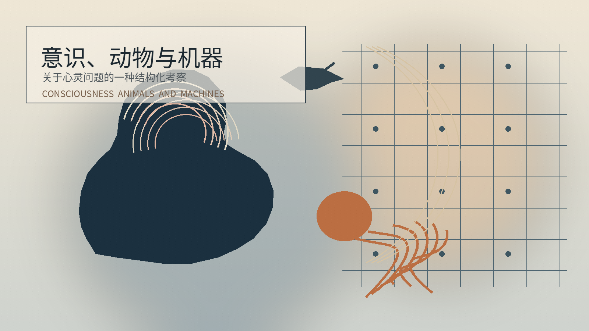
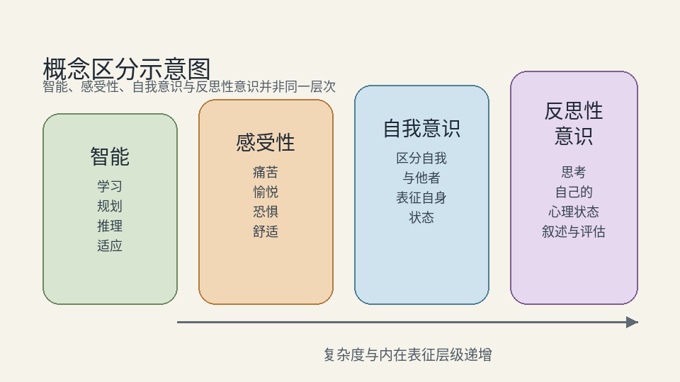
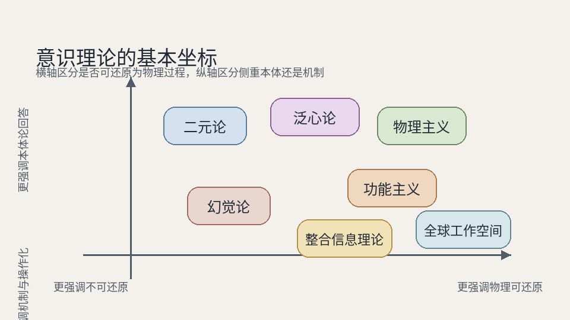
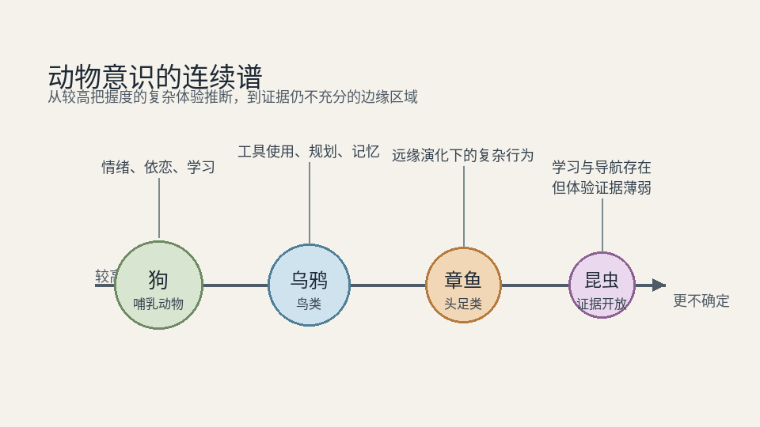
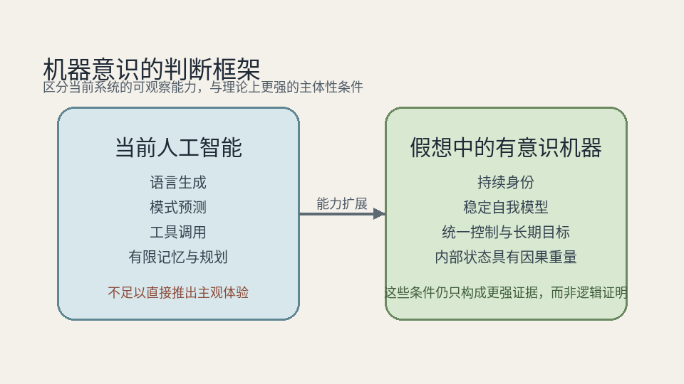

## 摘要

一谈意识，话题就很容易滑走。有人谈智能，有人谈自我意识，有人谈语言报告，还有人直奔“主观体验”本身。表面上看是在讨论同一个词，实际上常常不是同一个问题。于是，关于动物有没有意识、机器会不会有意识、人类是不是特殊存在，这些问题就会越谈越乱。与其急着给出结论，不如先把问题拆开：哪些是概念问题，哪些是理论问题，哪些是证据问题。沿着这条线再往下看，人类意识当然可能很特殊；但“特殊”未必等于“唯一”。动物意识更像一条连续谱，而机器意识则更像一扇尚未真正推开的门。

## 引言

意识之所以麻烦，不只是因为它难，而是因为它离我们太近。我们每天都在经验它，所以很容易误以为自己已经知道它是什么；可一旦要认真解释，分歧马上就来了。

有人觉得意识就是会思考；有人觉得意识就是能说“我知道我在想什么”；也有人坚持，前面这些都不重要，真正要紧的是“有没有感觉”这件事本身。三种说法都不算全错，但混在一起就容易出错。

然则，关于意识的许多争论，问题未必出在答案上，而是出在提问方式上。若不先把概念边界厘清，后面关于动物、机器和人类特殊性的讨论，大概率会在一开始就错位。

## 一、关键区分：意识并不等于智能

最容易混淆的一组概念，就是意识（consciousness）和智能（intelligence）。

智能说的是一个系统会不会学习、规划、推理、解决问题；意识说的则是，成为这个系统是否“有某种感觉”。两者当然可能重叠，但并不相互推出。一个系统可以非常聪明，却没有任何主观体验；反过来，一个系统也可能有痛苦、有愉悦、有恐惧，但并不擅长抽象思考。

接着还要区分感受性（sentience）和自我意识（self-awareness）。感受性关心的是会不会痛、会不会快乐、会不会害怕；自我意识关心的是，它能不能把自己当作“自己”来表征，知道哪些状态属于自己，哪些不属于。前者门槛更低，后者要求更高。很多时候，人们其实是把“缺少人类式自我反思”误当成了“没有任何体验”。

现象意识（phenomenal consciousness）和通达意识（access consciousness）也是如此。前者是体验本身，比如红色之所以显得“红”，疼痛之所以显得“痛”；后者是某个信息能否进入记忆、推理、报告和决策系统，被系统调用和使用。很多理论其实更擅长解释后者，却常常被误以为已经解释了前者。

还有一个区分也很关键：最小意识（minimal consciousness）与反思性意识（reflective consciousness）。最小意识只要求有基本的感受和知觉在发生；反思性意识则要求主体能够把自己的心理状态拿出来看、拿出来想、甚至拿出来叙述。人类显然在这一层走得很远，但这最多说明人类意识更厚、更复杂，并不直接推出别的生物完全没有意识。

换句话说，若不把这些层次分开，后面很多判断都会出问题。比如“它会解决问题，所以它有意识”，这是把智能当成意识；“它不能像人一样谈论自己，所以它没有感觉”，这是把反思性意识当成全部意识。两者都太快了。

## 二、主要理论：本体、机制与说明范围

概念分清以后，接下来就要看不同理论到底在解释什么。

物理主义（physicalism）是最自然也最主流的一条路。它认为意识并不是什么飘在身体之外的神秘东西，而是物理过程的一部分，尤其和大脑活动紧密相关。这一立场的好处很明显：脑损伤会改变意识，麻醉会压低意识，药物会扭曲意识，睡眠会切换意识状态。这些现象都很难和“意识完全独立于物理过程”相容。

但问题也随之而来：即便这些相关性都成立，为什么某些物理过程不只是运转，而且还会被体验到？这就是意识问题总绕不开的难点。

功能主义（functionalism）把注意力从“材料”挪到了“组织结构”上。按它的思路，关键不在于一个系统是不是由神经元构成，而在于它有没有实现某种足以支撑意识的因果结构、信息整合和自我调节。这个思路很重要，因为它一方面让动物意识更容易被认真对待，另一方面也让机器意识在原则上变得可讨论。当然，反对者也会追问：结构足够像，功能足够像，是否就一定意味着体验也来了？

二元论（dualism）则代表另一种直觉：意识和物理过程之间始终隔着一道坎。这个立场的吸引力在于，它没有轻易把主观体验消解掉，而是承认“感觉本身”确有一种特殊性。但麻烦也不小：如果意识真有不可还原的成分，那它如何和身体发生关系？又如何进入经验研究？

幻觉论（illusionism）走的是另一条路。它怀疑的不是物理主义不够强，而是我们对意识的直觉理解本身可能就带着误导。那些看起来纯粹、私密、不可拆解的体验，也许并不像我们想象得那样存在，而更像是心智为自己生成的一套模型。这个思路很锐利，但也很容易让人不服：若连体验都被说成是一种幻觉，那么“幻觉被经验到”这件事又如何解释？

泛心论（panpsychism）则更进一步。它不愿意接受意识从完全无意识的物质中突然冒出来，于是干脆把意识或某种原始意识属性视为现实的基本成分之一。这个想法很有吸引力，因为它试图绕开“体验从何而来”的断裂；但它马上又会碰到另一个难题：散落在各处的微弱体验，究竟如何组合成一个统一的“我”？

此外，全球工作空间理论（Global Workspace Theory）和整合信息理论（Integrated Information Theory），则更像两种努力把问题往可操作方向推进的模型。前者强调信息何时进入全局共享，后者强调系统内部整合到何种程度。它们的价值不小，至少让意识研究不只是停留在抽象争辩；然则，模型更清楚，并不等于“为什么会有感受”这个问题已经解决。

## 三、动物意识：从边界判断转向连续谱分析

谈动物意识，最糟糕的问法其实是：它们是不是像人一样意识到自己在意识着？

这个标准太高，也太人类中心。它把一种高度语言化、反思性的意识形式，当成了意识本身。更合理的问题其实是：不同动物会不会有体验？如果有，它们的体验可能丰富到什么程度？

支持动物意识的证据，通常不是某个单独行为，而是一组相互支撑的表现：会不会学习，会不会形成稳定偏好，会不会为了躲避痛苦改变策略，会不会在新环境里灵活调整，会不会玩耍、依恋、探索，甚至表现出相对稳定的行为风格。单纯反射当然不够；但当一个生物不仅会反应，还会权衡、会期待、会回避、会适应，就很难再把它简单归入“纯机械反应”。

狗是一个相对稳妥的案例。它们会痛、会怕、会兴奋、会依恋，也会在和人以及其他动物的互动里表现出明显复杂于反射的情绪和学习能力。把狗看成有感受性的存在，并不需要太激进的推论。

乌鸦这类鸦科动物则提醒我们，复杂体验未必只能依附在和人类相近的大脑结构上。工具使用、问题解决、记忆和策略性行为，至少说明鸟类站在比许多人想象中更高的位置。

章鱼更有意思。它和我们在演化上离得很远，却依然表现出探索、学习、问题解决和相当明显的个体差异。若章鱼也有意识，那么这件事的意义就不只是“又多了一种有意识动物”，而是意识可能并不依赖一套几乎复制人脑的装置。

昆虫则处在更不确定的位置。它们当然也能学习、导航、交流；但这些现象到底是否需要诉诸主观体验，仍然缺少足够稳固的把握。因此，与其轻率地下判断，不如承认这里有很大的灰度地带。

所以，动物意识更像一条连续谱，而不是一道整齐的边界线。有些位置上证据很强，有些位置上证据很弱，中间则是一大片需要谨慎处理的过渡区域。这样的看法，比“只有人类有意识”更符合生物连续性，也比“只要行为复杂就一定有意识”更克制。

## 四、机器意识：理论可设想性与现实证据约束

机器意识之所以让人兴奋，也让人警惕，是因为它逼着我们把一个问题问到底：意识究竟依赖什么？

如果意识必须依赖生物组织，那么机器再聪明，也只是工具；如果意识依赖的是某种信息结构、整合方式和自我维持机制，那么人工系统至少在原则上不该被提前排除。

支持机器意识的最强理由，正是这种基底无关性的思路。人脑并不是魔法，而是一个物理系统。既然如此，真正关键的也许不是“是不是碳基”，而是“有没有形成某种足以支撑主体性的组织方式”。

但反对者的论点也很强：功能模仿未必等于体验出现。一个系统完全可能在语言上表现得像有感受，在行为上表现得像有内心，但内部并没有任何可被称为主观体验的东西。这正是哲学僵尸、中文房间一类论证不断被提起的原因。

所以，今天谈机器意识，最需要避免的不是怀疑，而是草率。当前人工智能系统确实会写、会答、会规划、会调用工具，也能在很多局部任务上显得相当灵活；但这些能力本身，离“有一个持续的自我”还差得很远。

真正值得问的问题是：它能不能跨时间维持稳定身份？能不能形成真正的自我模型？能不能在内部组织中让某些状态具有持续的因果分量？能不能在长程目标和内部冲突之间形成统一调节？这些问题都比“它会不会说自己有意识”重要得多。

即便未来系统在这些方面大幅增强，我们也未必能得到一个像数学证明那样干脆的结论。机器意识更可能是一种逐步逼近的判断，而不是一锤定音的判决。

这也意味着，机器意识不只是技术问题，还是伦理问题。如果某种系统真的可能有体验，那么删除、复制、操控、剥削这些行为，就不再只是工程操作，而会开始带上道德重量。现在离这一步也许还很远，但这恰恰意味着更不该轻率。

## 结论

意识问题之所以始终难缠，不是因为人类不够聪明，而是因为它同时跨了几个层次：概念、机制、证据，缺一不可。

先把意识和智能分开，把感受性和自我意识分开，把最小意识和反思性意识分开，至少能让讨论站稳。再往后看，不同理论也并不是在回答完全相同的问题：有的在问意识是什么，有的在问意识如何发生，有的则是在问我们凭什么判断意识存在。

沿着这条线看下去，人类意识当然可能是特殊的，尤其在叙事性、时间延展性和反思能力上；但特殊并不等于孤绝。动物意识更像一张分布不均的地图，而不是一道整齐的国境线；机器意识则像一扇尚未真正推开的门，我们知道它可能通向什么，却还没有足够理由宣布门后已经有人。

比起急着下最后判决，更重要的也许是把判断标准磨得更锋利一点。只有这样，意识这个问题才不会永远停留在惊叹、投射和口号里。
