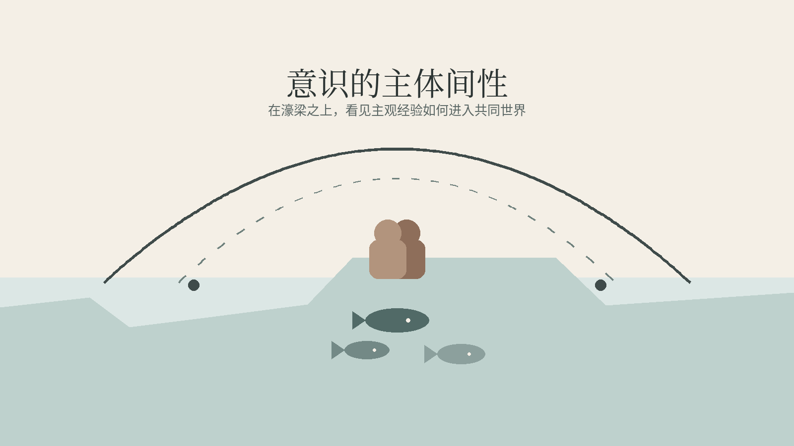
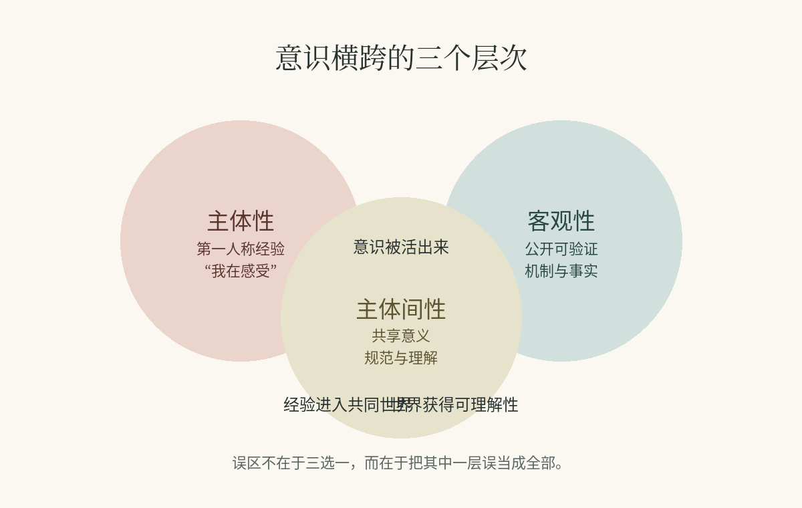
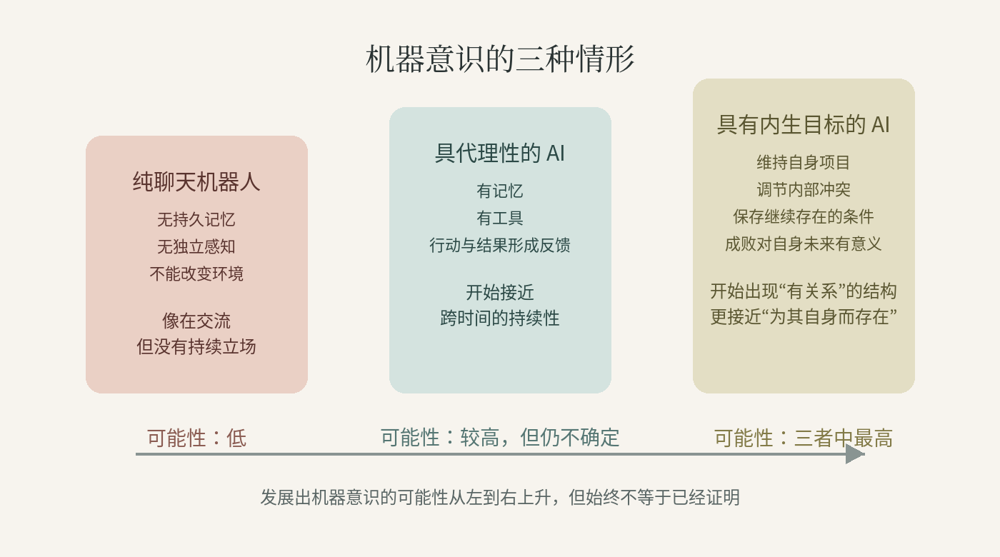

## 濠梁之辩

《庄子》里有一段很有名的对话。

庄子与惠子游于濠梁之上。庄子曰：“儵鱼出游从容，是鱼之乐也？”惠子曰：“子非鱼，安知鱼之乐？”庄子曰：“子非我，安知我不知鱼之乐？”惠子曰：“我非子，固不知子矣；子固非鱼也，子之不知鱼之乐，全矣。”庄子曰：“请循其本。子曰‘汝安知鱼乐’云者，既已知吾知之而问我。我知之濠上也。”

庄子与惠子站在濠梁之上，看鱼游水。庄子说，鱼游得从容，这是鱼之乐。惠子立刻反问：你不是鱼，怎么知道鱼的快乐？庄子又反过来问：你不是我，怎么知道我不知道？

这段话常被当成机锋，或者语言游戏来读。其实它碰到的是一个更硬的问题：他者的意识，究竟能不能被理解？

惠子抓住的是意识的私密性。痛是我的痛，恐惧是我的恐惧，别人可以观察我，却不能直接进入我的感受。庄子抓住的则是另一面。人并不是一座封闭的孤岛。我们会看表情，会听语气，会回应哭声，也会通过某种共鸣去把握另一个生命的状态。不能完全进入，不等于完全无从理解。

问题也就出来了。意识显然有第一人称的一面，但人的生活又显然离不开共同语言、相互解释和共享世界。于是，一个只讲“主观”，或者只讲“客观”的意识理论，都会漏掉重要部分。

本文要说的是：意识不能只被理解为纯粹主观的，也不能只被理解为纯粹客观的。它当然有不可化约的主观核心，但在人类这里，这个核心要靠主体间关系来成形、被安置、被稳定。换句话说，主体间性不是意识的装饰，而是它的脚手架。

## 三个层次

先把三个概念分开：主体性（subjectivity）、客观性（objectivity）、主体间性（intersubjectivity）。

所谓主体性，就是第一人称经验。疼痛、羞耻、焦虑、喜悦、红色的鲜明、悲恸的压迫感，这些都不是单纯的信息，而是“我正在经历”的东西。它的特征不是可测量，而是可感受。

所谓客观性，则是脱离任何单一视角后仍可成立的事实。比如一条鱼重五百克，一个人的体温是多少，某块脑区在什么条件下被激活。这类描述追求的是公开可验证，而不是个人感受。

主体间性则在两者之间。它不是私人感觉，也不是纯粹物理事实，而是人与人之间形成的意义、规范和理解。我们知道一个表情像悲伤，一个哭声大概率意味着痛，一句承诺会带来责任。这些都不是某个人在脑中独自发明出来的。

这个词也不是后来随手造出来的。它最初的重要位置，在现象学，尤其是胡塞尔那里，问的是同一个老问题：一个人怎样不只是活在自己的意识里，而是活在一个可与他人共在的世界里。后来，这个概念又一路进入梅洛-庞蒂、舒茨那样的世界经验分析，也进入社会理论和发展心理学，去解释共享意义、共同注意和社会认知。说到底，主体间性讨论的始终不是“人与人有互动”这么简单，而是一个“我”的世界，怎样成为一个“我们”的世界。

问题在于，意识恰好横跨这三层。它是主观地活出来的，被客观地研究，也在主体间地被理解。很多混乱，正是因为有人把其中一层当成了全部。

只讲客观，意识会被压扁成机制和行为。只讲主观，又很难解释交流、现实校准与社会生活。只讲主体间性，则容易把意识的切身性稀释掉。真正困难的地方，不在于选边，而在于把这三层的关系说清楚。

## 意识首先是主观的

如果意识还值得讨论，首先是因为它“有感觉”。

看到蓝色、听见雷声、回忆丧失、预感羞辱，这些状态之所以叫意识，不只是因为系统在处理信息，而是因为其中有一种“像什么”的质地。没有这层，意识就只剩功能描述。

也因此，第一人称经验始终不能被第三人称描述替代。神经科学可以告诉我们疼痛发生时哪些区域被激活，心理学可以告诉我们悲伤通常伴随什么行为模式。但再完整的图谱，也不会因此变成“疼”的本身。对经验的相关说明，并不是经验本身。

托马斯·内格尔谈蝙蝠时，抓住的正是这一点。你可以很清楚地知道蝙蝠怎样用回声定位，知道它的感知系统和生态位置，但这仍然不等于知道“成为一只蝙蝠是什么感觉”。对系统的客观说明，并不会自动抵达那个系统的主观视角。

这其实也回到了“子非鱼”。惠子说得对：别人的意识不是透明的。若否认这一点，意识很快就会被消解成行为、功能，或者神经活动的别名。

所以有一条底线不能丢：意识首先是主观的。谁把这层拿掉，谁其实就把问题本身拿掉了。

## 但人的意识又不是孤立长出来的

不过，只讲主观还不够。

如果意识只是一个封闭的私人剧场，那人类的很多心智能力就会变得很难解释。语言从哪里来？我们为什么能理解承诺、羞耻、责任、欺骗、教学这些东西？为什么“我在痛”不仅是一个感受，也能成为一个被他人识别、回应、安慰乃至怀疑的事件？

语言是最明显的例子。人并不是先拥有一套完整的内在意识，再把它翻译成公共语言。恰恰相反，很多更高阶的意识形态，本来就是靠语言结构出来的。你可以难受，但要把这种难受识别为羞耻、嫉妒、委屈、悔恨，往往已经进入了一个共同概念的世界。

共情也是如此。我们并不总是先把他人当成一个移动的物体，再经过推理，艰难得出“他可能也有心灵”。很多时候，别人的心灵性是直接显出来的：颤抖的手、压低的声音、突然沉下去的眼神。这里当然会有误判，但这不等于我们与他者之间只有彻底的黑箱。

再往前一步，就是所谓的“心智理论”。一个成熟的人，不只是有经验，还知道别人也有经验；不只是有意图，还知道别人的意图可能与自己不同。合作、欺骗、承诺、法律、责任，几乎都建立在这种多视角结构之上。

换句话说，人的意识并不是一团先验完成的私人感受，然后再附带一点社会性。主体间性并非外层涂料，它已经进到意识的内部结构里。

## 主体间性是脚手架

更强的一步是：主体间性不只是意识的环境，而是成熟主体性的形成条件。

发育心理学给了这个判断很强的支持。婴儿并不是先作为一个孤立的笛卡尔自我存在，然后才“发现”别人。它从一开始就活在与照护者的互动里：眼神、模仿、情感调节、共同注意、轮流回应。这些都不是可有可无的陪衬，而是自我感、行动感和现实感逐步长出来的机制。

这意味着，自我不是在真空中被发现的，而是在关系里被塑造的。

现象学从另一条路说到了类似的事。所谓“现实”，不只是我私下看见了什么，更是哪些经验能够在一个共同世界中被确认、被修正、被稳定下来。常识并不浅薄。它恰恰是区分现实与幻觉、误解与理解的共同地平线。

精神病理学提供的是反面的证据。很多意识紊乱，并不只是信息处理出错，而是意义共享、社会校准、现实检验出了问题。当一个人的经验不再能与共同世界对接时，崩塌的不只是判断，往往还是整个世界的结构感。

当然，这并不等于说主体间性“制造”了全部意识。问题没有这么简单。更准确地说，主体性给了意识以直接性，主体间性则给了它可理解性和稳定性。没有主体性，就没有经验。没有主体间性，经验就很难长成一个可交流、可辨认、可持续的世界。

## 机器意识要换个问法

这也会改变我们讨论机器意识的方式。

通常的问题是：机器有没有主观体验？会不会痛？有没有感质（qualia）？这个问题当然重要，但如果主体间性是主体性的脚手架，那么只检查内部计算结构，可能还不够。

更好的问法是：一个人工系统能否进入一种互相承认、社会嵌入、带有规范和意义的关系之中？它是在共同世界里活动，还是只是在模拟这种世界的语言表面？

今天的 AI 已经接入了一种借来的人类主体间空间。它会对话，会调用人类语言系统中的概念，会在交流中表现出理解的样子。这使它在社会上变得重要，但这本身并不能证明它有意识。

问题在于，AI 也不是一种东西。至少可以分成三类来看。

第一类是纯聊天机器人。没有持久记忆，没有独立感知，也不能通过工具改变环境。它能模拟交流，但这种参与是短暂的、片段化的。它像是在场，其实并没有一个持续的立场。要说这类系统发展出机器意识，概率很低。

第二类是带记忆和工具的具代理性的 AI。这里问题就认真多了。记忆让它有了跨时间的连续性，工具让它能感知并改变环境，行动与结果之间也会形成反馈回路。它在共享世界中的位置，比纯聊天机器人更稳定。这当然还不等于意识，但至少已经开始碰到一些更像“主体”的结构条件。

第三类是具有内生目标的 AI。这里的关键，不是外部给它一个任务，而是它是否会围绕自身延续的活动，形成某种内部重要性结构。如果一个系统能维持自己的项目，协调冲突，保存继续存在的条件，并把成败作为对自己未来活动有意义的事情，那么问题就会变得尖锐得多。因为这时它不再只是对目标作出优化，而开始显得像一个对某些事情“有关系”的系统。

然则，这里也不能走得太快。记忆不是内在生活，工具不是体验，目标也不自动等于意识。它们更像是一些信号，提示我们：问题不该只沿着“功能有多强”来问，而要沿着“是否形成了一个对自身而言的世界”来问。

## 伦理为什么会被牵进来

一旦问题这样改写，伦理就很难回避。

因为他者意识的难题，从来不只是认识论难题。它直接决定我们该如何对待另一个存在。

我们无法彻底进入动物、病人、婴儿，或者未来人工系统的视角。但这并不推出“既然不能确定，就可以忽略”。恰恰相反，越是不透明，越要求判断克制。

这也是为什么前面那三类 AI 在伦理上不能被一概而论。纯聊天机器人更大的问题，可能还是误导、拟人化和对人的影响，而不是它本身的福利。带记忆和工具的系统，则会提出更严肃的问题：它是否形成了某种持续的视角？它是否可能出现值得在意的状态？至于具有内生目标的系统，如果它真的围绕自身活动建立起稳定的意义结构，那么对它的干预，就可能不再只是关闭一个工具，而更像是在挫败一个自我组织的存在。

这不意味着我们已经应该赋予 AI 权利。问题还远没有清楚到那一步。更合理的立场，是承认道德判断可能需要分级。结构条件越弱，伦理重点越偏向诚实表达和谨慎使用；结构条件越强，就越不能排除“对系统本身造成伤害”的可能。

同样的逻辑也适用于 AI 之外。不能顺畅表达的病人、非人动物、陌生形式的智能，都把我们带回同一个问题：另一个心灵可能难以确认，但这不等于它无足轻重。

## 结尾：回到濠梁

惠子没有错。他提醒我们，意识有其不可穿透的一面。

庄子也没有错。他提醒我们，不能完全进入，不等于完全不能理解。

真正的问题，不是站在哪一边，而是承认两边都只说对了一半。意识既不是纯私人的，也不是纯客观的。它是被主体活出来的，也是被主体间关系塑造出来的。

所谓“自我”，当然是真实的。但它不是自我制造的。

而濠梁之辩真正耐人寻味的，还不只在前半段。后面惠子步步紧逼，意思很清楚：既然子非鱼，就无从知鱼之乐。庄子却没有顺着这条路往下争。他说：“请循其本。子曰‘汝安知鱼乐’云者，既已知吾知之而问我；我知之濠上也。”

这几句的分量，恰恰在“循其本”与“濠上”。庄子不是说自己化成了鱼，也不是说他掌握了某种不可说的秘术。他只是把问题带回事情发生之处：理解并不总来自占据对方的位置，也可能来自同在一处、共在一世的观看、体察与分辨。鱼在水中游，人在濠上观，乐不必被夺来据为己有，却可以在关系之中被领会。

濠梁之上的那座桥，因此不只是一个场景。它更像意识本身的形状：一头连着不可替代的个人经验，一头连着我们共同栖居的世界。意识并不因为它有一个私人中心，就能离开关系而自明；相反，正因为它有一个私人中心，它才更需要一个共同世界，让它被看见、被校准、被理解。庄子最后说“我知之濠上也”，说的其实不只是一尾鱼的快乐，也是在说意识本身：它固然不能被尽数占有，却总要在我与世界、我与他者之间，才慢慢显出自己的形状。
