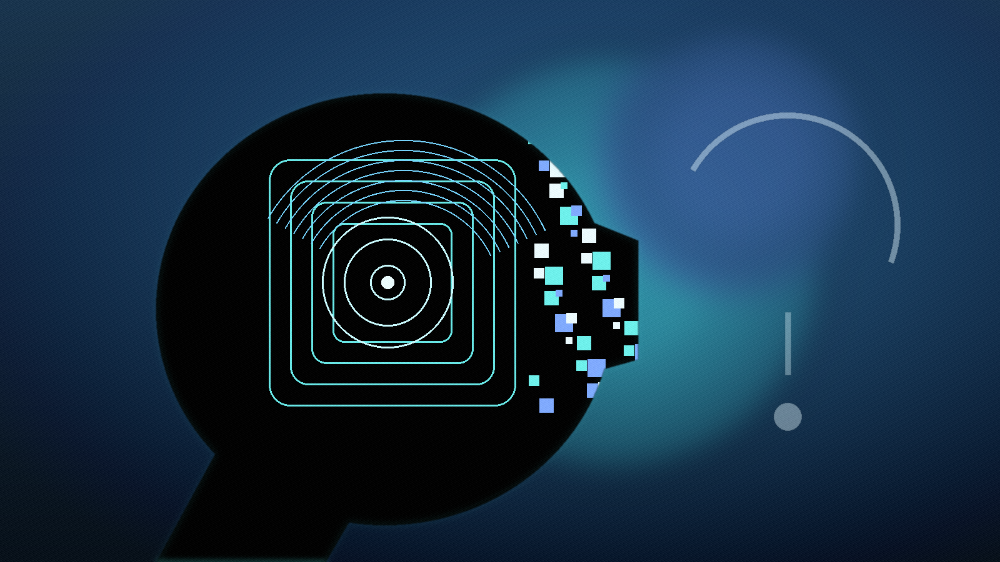

# 我思，故我在？

笛卡尔（1596-1650）这位近代哲学的奠基者，发明了一种现在仍可有益地加以使用的方法--系统怀疑法。他决定相信，没有被他清楚明白地看到的东西都不是真的。他会怀疑他所能怀疑的任何东西，直到发现没有理由怀疑为止。但是，通过应用这种方法，他逐步确信，他能完全肯定的唯一存在就是他自己的存在。他想象，有一个骗人的恶魔在连续的幻觉中把非实在的事物呈现于其感官前。这样的一个恶魔的存在也许是概率很小的事情，但是这依然是一种可能性；而且，怀疑感官所感知到的事物因此也是可能的。

但是，怀疑他自己的存在则是不可能的，因为假如他不存在，就没有恶魔能够欺骗他。假如他怀疑，他就一定存在；假如他拥有不管什么样的经验，他就一定存在。因而，他的存在对他而言是完全确定的。他说，“我思故我在”（Cogito, ergo sum）；以这样的确定性为基础，他开始再次建立被他的怀疑所毁灭了的知识世界。通过发明怀疑法，并表明主观的东西是最确定的，笛卡尔对哲学做出了一次重大贡献，而且对于这个学科的所有研究者而言，这一贡献使他至今仍然是重要的。

上面是罗素在《哲学问题》中对笛卡尔最重要的思想的肯定。接着话锋一转，他就对此做出了严厉的批评：

但是，在使用笛卡尔的论证时，必须多加小心。“我思故我在”（I think, therefore I am）并未表达出严格意义上确定了的东西，我们似乎完全肯定今天的我们就是昨天的我们，而且这在某种意义上无疑是真的。但是，实在的**自我**，就像实在的桌子（代表物理对象）一样，是难以达到的，而且似乎并不具有特殊经验所具有的那种绝对而又令人信服的确定性。当我看我的桌子并发现某片棕色时，立刻能够完全确定的东西并不是“我看见一片棕色”，而是“一片棕色被看见了”。这当然牵涉看见这片棕色的某个事物（或某个人），但这本身并不牵涉被我们称为“我”的那个或多或少永久存在的人。就当下能够确定的而言，看见这片棕色的某种东西也许完全是瞬间性的，而并不就是下一时刻具有某种不同经验的东西。

就这样，罗素否定了“自我”具有根本的确定性，它的地位大概和“物理对象”一样，是*本能*的信念。所谓本能的信念，是指我们无法证明其存在，但假定它确实存在，对我们经验的解释就大大地简单了。而也正因为它非常简化的作用，才成为我们本能的信念。只有我们的特殊思想和感觉，才具有根本的确定性。这才是“我思故我在”能够确定的。

## 自我与自由意志

我们通常对自我的信念是：每个人都有单一的、不可分割的自我。进一步还有一个信念：每个自我具有自由意志，为自己做决定，同时自由意志通过其决定也反过来重塑了自我。这是人文主义（Humanism）的根本前提，更是整个现代世俗社会从法律到政治、经济得以建立的底层逻辑。一个人犯罪，是因为他拥有自由意志却主动选择了作恶，因此他必须为自己的行为承担道德和法律责任。民主选举基于“选民的自由意志”，每一张选票都代表一个独立的自我做出的选择。消费者的自由选择驱动了市场，个人通过购买行为表达自己的审美和需求；在自由市场中，“顾客永远是对的”。

然而这种信念受到了越来越多的质疑，首当其冲的是自由意志。传统观点认为：意识到意图后，大脑发出指令，然后身体行动。但神经科学证据表明，这个顺序其实是颠倒的：在受试者意识到自己想法（按按钮）前，大脑负责规划运动的区域就已经出现了一种名为“准备电位”的电信号（里贝特实验）；通过功能性磁共振成像分析受试者前额叶皮层（负责高级决策的区域）的神经活动模式，研究人员甚至可以在受试者自己意识到决定的 7 到 10 秒之前，就提前预测出他们会选左手还是右手，准确率远高于随机概率（海恩斯实验）。心理学研究发现，人类经常产生“这是我自己做的决定”的错觉。事实上，我们常常是被潜意识或外部环境操纵了，但大脑为了维护“自我”的掌控感，会强行编造一个理由（裂脑人实验）。如今两个自我：“体验自我”（Experiencing Self）和“叙事自我”（Narrative Self）已经是一个比较广泛的共识，正是后者编造了自由意志的错觉。

不过，严格地说，这些实验还不足以直接推出“自由意志不存在”。里贝特实验和海恩斯实验中的任务都相当简单，离现实生活中的复杂权衡还很远；而且，准备电位究竟代表“无意识决定已经完成”，还是仅仅代表某种运动准备或噪声积累，学界也还有争论。它们更有力地削弱了“一个透明的自我先做决定，再命令身体执行”这种朴素图景，却未必已经终结了关于自由意志的一切讨论。

很多人会觉得自由意志不一定要和意识绑定，自由意志就是“依自己的欲望行事”。按这个定义人类确实有自由意志，但这么说来小猫、小狗也一样有自由意志。也有人试图用量子不确定性来拯救自由意志，认为自由意志源于大脑神经元内部微管中的量子过程。但是这同样很奇怪，因为量子过程随机不等于自由。如果你的决定是由亚原子粒子的随机坍缩决定的，那它就像在大脑里掷骰子，这叫“随机事件”，不叫“我的意志”。

不过，自由意志问题与自我问题并不完全重合。前者问的是“决定如何产生、是否由主体自主发起”，后者问的是“经验为何会以第一人称方式被组织起来，并被我们归属于某个‘我’”。

叙事自我的存在提醒了我们，在讨论自我的时候我们需要搁置固有的观念，自由意志并不是唯一的一个。

## 自我与第一人称体验

即使对自己的决定是否完全自己做出没有十足的把握，我们却相当有把握说“这是我的感觉”和“这是我的行动”。这是自我的另一个信念：“我的性”（Mineness），它包括两种感觉：“所有感”（Sense of Ownership）---我的肢体在移动；“施效感”（Sense of Agency）---我是行动的发起者。这种感觉并不需要叙事自我来解释，甚至无需反思，它是本能的、具身的，不需要任何语言去标记。即使一个婴儿，也能够区分自己手指触摸自己的脸颊还是他人手指触摸（寻乳反射）。当然，这时的婴儿有没有一个“自我”还要看后者的定义。

所有感和施效感是肖恩·加拉格尔（Shaun Gallagher）的“最小自我”的标志。提出最小自我的概念大概是希望找到一个不可继续还原的自我意识的核心，比如说将“叙事自我”剔除后是否还有一个能称之为“自我”的东西。它被用来解释“橡胶手错觉（所有感被欺骗）”和精神分裂症患者经历的“思想植入（失去施效感）”。然而这样一个“最小自我”似乎过于单薄，无法解释更复杂的心理现象，加拉格尔后来也改造了这个理论（“4E认知”与“行动网络”）。

与加拉格尔的“最小自我”相近但并不等同，托马斯·梅辛格（Thomas Metzinger）提出了“最小现象自我感（MPS）”这一概念。它强调的不是一个不可再简化的实体性自我，而是意识中最小限度的“我在这里”的现象结构。换句话说，在你的主观体验中，要亮起“我是一个自我”的最小红灯（即 MPS 激活），你的意识视窗里必须同时打包出现以下三种现象学质感：
- 全局自我识别（Global Self-Identification）： 这对应了现象学上的“我的性”。但请注意，它被严厉限定为“对身体整体的所有感”，而不是局部（比如不仅是“我的手”，而是“我的整个活体躯干”）。
- 时空自我定位（Spatiotemporal Self-Location）： 你感知到你自己这个整体，在此时此地的空间中占据了一个明确的坐标点（通常在头颅或身体内部）。
- 弱第一人称视角（Weak 1PP）： 一种前反思的、空间几何学上的定向视窗。世界是从“这里”向外延伸的。

有意思的事情来了，最小现象自我感可能是“虚拟现实”！你以为的感觉来自现实世界，你的意念驱动了现实的动作，其实并非如此，你的感觉来自于大脑里宏观的现象自我模型，你的意念不过是对这个模型的操作。换句话说，你以为你在操作一台计算机，其实你在操作跑在里面的一个虚拟机。但更谨慎的说法是：你的感觉和行动经验，首先都要经过大脑对现象自我模型的组织与呈现；而“虚拟现实”或“虚拟机”，只是描述这种界面的一个强比喻。关于自我的虚拟机是什么样的构造，梅辛格的自我模型理论（SMT）给出了详细的描述，就不在这里展开了。

## 哪些现象支持自我的建构性

有人会问，为什么我要倾向于用“虚拟机”来理解自我，而不是把自我看成一个直接显现、不可再分析的实体。更谨慎的说法其实不是“这些现象证明了自我是虚拟机”，而是：它们反复显示，我们对“我在这里感受、行动、占据一个身体”的经验，并不是透明地贴在世界本身之上，而是高度依赖大脑对感觉输入、身体边界与空间定位的整合。

在 IT 领域，虚拟机这个比喻之所以有吸引力，是因为它强调：我们日常使用的界面，未必等同于底层真实的运行方式。借用到自我问题上，它并不是一个已经被实验直接证明的本体结论，而是一个帮助我们理解“自我经验具有建构性”的解释框架。以下四类现象的意义，也更适合在这个较弱但更可靠的层面上理解。

1. 虚拟机的“画面掉帧”：出体体验（OBE）
在正常情况下，大脑这台虚拟机的全屏模式天衣无缝，你的“视窗原点（1PP）”和“肉体重心（Mineness）”是重合的。但通过物理刺激，科学家可以让这两个虚拟组件在空间上错位。

实验（Olaf Blanke，2002）：认知神经科学家布兰克在给一名癫痫患者进行术前脑区映射时，用微弱电流刺激了患者的右侧颞顶交界处（rTPJ）（该脑区负责整合前庭觉、视觉和本体感觉）。

Debug 现象：患者在清醒状态下，突然惊叫起来。她发现自己的第一人称视角（1PP）瞬间被“弹”到了天花板上，她正在从高处俯瞰躺在床上的自己。

支持逻辑：这一现象至少说明，第一人称视角、身体位置感与自我定位并不是不可拆分的一整块，而是可以在特定条件下发生错位的不同成分。更稳妥的结论不是“灵魂被拆开了”，而是：自我在空间中的在场方式依赖于可被扰动的神经整合机制。正因为如此，用“虚拟机界面”来比喻这种可被重配的自我经验，才显得有解释力。

2. 虚拟机的“外设欺骗”：全身橡胶手错觉（Full-Body Illusion）
既然是虚拟机，它渲染身体边界时就必须依赖算法。如果输入错误的感官补丁，虚拟机就会把“不属于你的硬件”强行识别为“自我”的一部分。

实验（Henrik Ehrsson, 2007）：实验者让参与者戴上虚拟现实（VR）眼镜。眼镜里实时播放的是“站在参与者身后2米处的摄像机”拍到的参与者自己的背影。接着，实验者用一根木棍抚摸参与者真实的胸口，同时用另一根木棍在空气中虚晃，去抚摸 VR 画面中那个背影的胸口（保持节奏完全同步）。

Debug 现象：短短数十秒后，参与者经历了强烈的视觉-触觉绑定。他们真切地感觉到：“我”不在这个真实的肉体里，我的自我已经迁移到了前方2米处的那个虚拟化身（Avatar）身上。当实验者用一把刀去砍那个虚拟化身的空气时，参与者全身皮肤电反应飙升，产生了本能的恐惧。

支持逻辑：这个实验强烈表明，大脑并不是被动记录一个早已给定的“我在哪具身体里”，而是在根据多模态感觉的一致性，动态生成身体归属和自我定位。它支持的是“身体性的自我经验可以被诱导和重写”，而不是直接证明“真正的自我就是某种虚拟实体”。“虚拟机”这个说法，只是在强调这种身体归属感更像被实时渲染出来的结果。

3. 硬件下线，软件仍在跑：幻肢痛与幻盲症
支持你活在虚拟机里的另一个强证据是：当物理硬件已经卸载，虚拟机的UI界面却依然在倔强地渲染。

幻肢痛（Phantom Limb）：许多失去手臂的残疾人，在几年后依然能清晰地感觉到那只手不仅存在，甚至还在经历剧烈的疼痛、痉挛或发痒。拉马钱德兰（V.S. Ramachandran）证明，这是因为大脑皮层里的“身体地图（神经网络模型）”还没有删掉这行代码。

安东综合征（Anton's Syndrome）：一些由于大脑后部枕叶视觉皮层受损而彻底失明的患者，在临床上会坚称自己“看得见”。当他们撞到桌子时，他们会找借口说是“光线太暗”或“有人移动了桌子”。

支持逻辑：这类现象说明，主观经验并不总是与外部硬件状态一一对应。即便外周输入缺失或严重受损，大脑仍可能维持某种身体或世界的表征，并把它作为正在经历的现实呈现出来。因此，它们支持的是“经验内容受内部模型深刻塑形”，而不是简单证明“我们只活在虚拟世界里”。

4. 彻底的系统格式化：虚无妄想（Cotard's Delusion）
梅辛格提出，MPS 的最底层燃料是内脏植物神经的内稳态感知。如果把这层“生命背景音”的驱动卸载掉，会发生什么？

精神病学临床表现：患有科塔尔综合征（又称僵尸综合征）的患者，会极其痛苦且极其严肃地坚称：“我已经死了”、“我是一具尸体”、“我的内脏已经腐烂消失了”，甚至认为“我根本不存在”。

神经机制：研究发现，这类患者的大脑中，负责产生情绪和内脏感知的杏仁核及相关岛叶网络，与理性反思皮层之间的连接彻底断裂了。他们的肉体和大脑还在运转，但内脏感知的电信号无法再给虚拟机“充能”。

支持逻辑：如果这种解释成立，那么 Cotard 综合征至少提示我们，“我是活着的”“我是存在着的”这种最深层的存在感，也依赖某些具体的身体现象学与神经整合条件。这里更稳妥的说法是：存在感可能是一种会失效的建构结果，而不是一个永远自明的起点。至于是否应把这种建构称为“虚拟机”，那仍然是理论解释，而不是病例本身单独能够裁决的结论。

## AI能不能运行一个“我”

如果自我更像一个被运行出来的模型，而不是一个不可分割的灵魂，那么接下来的问题几乎是自动出现的：这套模型能不能迁移？既然虚拟机可以跑在不同的硬件上，那么以硅基芯片、神经网络和传感器为基础，是否也可能运行出某种“我”？

原则上，不能轻易排除这种可能。如果最小现象自我依赖的是一组功能条件，而不是某种神圣材料，那么身体边界的整合、空间位置的锁定、第一人称视角的持续生成，以及内外感受的绑定，似乎都属于原则上可以被工程化逼近的目标。至少在逻辑层面，人工系统产生某种最小意义上的“像我一样在场”，并不荒谬。

不过，这里最容易犯的错，不是高估 AI，而是把不同层级的“自我”混成一个概念：最小现象自我讨论的是第一人称在场的最低结构，而完整人格讨论的是记忆连续性、社会身份、责任归属与自我解释能力。一个完整的“我”并不只是一个视角中心，不只是“这里有体验正在发生”，它还包含记忆的连续性、叙事的组织、社会关系中的角色、责任归属、语言中的自我指称，以及在他人回应中逐步形成的交互主体性。换句话说，最小现象自我更像操作系统刚亮起的界面，而我们日常所说的那个“我”，还包括数据、历史记录、权限结构与外部连接。

这意味着，即便 AI 能够模拟某种最小现象自我，也未必等于它就拥有了人类意义上的自我。它也许拥有“我在这里”的结构，却没有“我一路走到这里”的厚度；也许拥有主体性，却没有传记；也许能说“我”，却还没有进入一个足以让“你我他”彼此追责、彼此承认的社会世界。

所以更谨慎的说法不是“AI 不可能有自我”，而是：我们必须先分清自己究竟在问哪一种自我。如果只是问能不能生成一个最小的第一人称界面，也许问题比想象中更近；但如果问能不能生成一个具有生命史、责任归属、社会嵌入和自我解释能力的“人”，那就不是把模型做大一点、把参数堆高一点就能回答的问题。

## 比 AI 更早的问题：那个“我”真的在吗

关于 AI 的讨论之所以这么热，一个原因是它看起来像未来问题：机器会不会有一天变成“我”？可沿着笛卡尔、罗素再到当代认知科学这条线索走下来，就会发现更麻烦的问题其实不是未来的机器，而是此刻的我们。

我们太习惯把“我”当作起点了。仿佛世界上最不需要证明的东西，就是有一个稳定、单一、持续、自主的主体在这里感受、思考、决定、承担。可前面的讨论恰恰在一点点削弱这个直觉：自由意志未必如我们以为的那样透明；“我的性”可以被操纵、错置和伪造；甚至连“我是活着的”这种最深的存在感，也可能因为某种神经整合故障而暗下去。

然则，这并不自动推出“我不存在”。更准确地说，它迫使我们承认：我们平时口中的“我”，并不是一个简单对象，而是一个被层层构造、层层维系的结果。它不是纯粹发明出来的假东西，但也绝不是一个未经中介、可以直接抓住的本体。它有现实性，但这种现实性更接近过程，而不是石头一样的实体。

这也许才是 AI 时代真正刺耳的地方。它之所以让人不安，不只是因为机器可能越来越像人，而是因为它逼我们承认：人本身也许没有自己想象得那样透明。我们一直以为自己是在捍卫人的独特性，最后却可能先发现，那个被捍卫的“我”，本来就是一个需要不断被解释、被维护、被更新的构造。

所以，比“AI 能不能成为我”更早的问题是：“我”究竟凭什么算是我？如果这个问题还没有想清，那么对 AI 的恐惧与期待，多半都只是把更基础的困惑向外投射。说到底，我们今天真正要面对的，不只是机器会不会觉醒，而是人是否终于开始认真怀疑：那个一直在说“我”的东西，到底是什么。

## 参考文献（简）

- Russell, B. *The Problems of Philosophy*.
- Gallagher, S. (2000). Philosophical conceptions of the self: implications for cognitive science.
- Metzinger, T. (2003/2004). *Being No One: The Self-Model Theory of Subjectivity*.
- Blanke, O., & Metzinger, T. (2009). Full-body illusions and minimal phenomenal selfhood.
